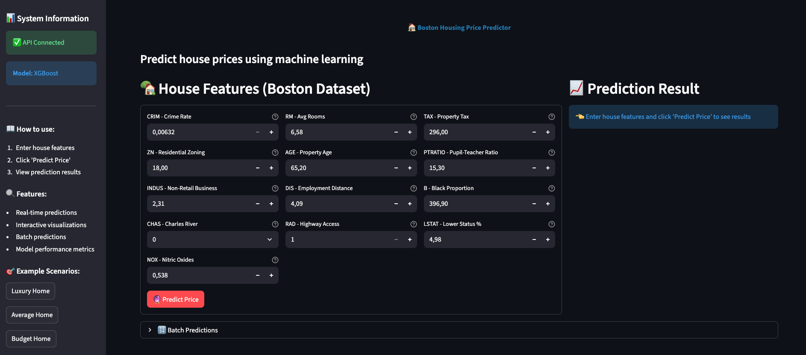
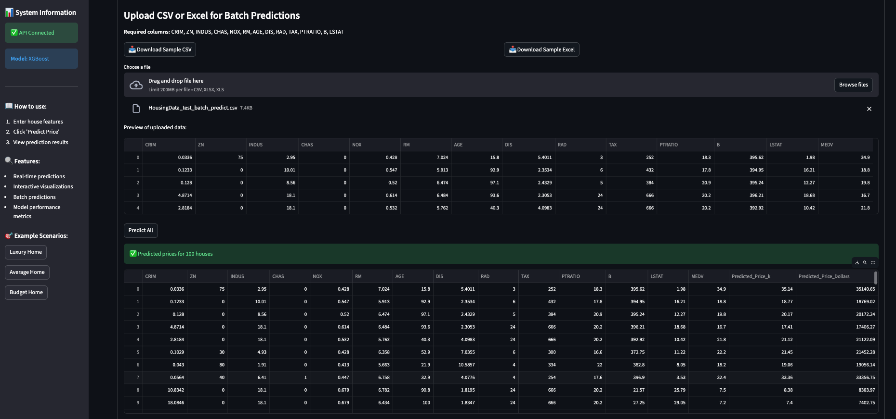
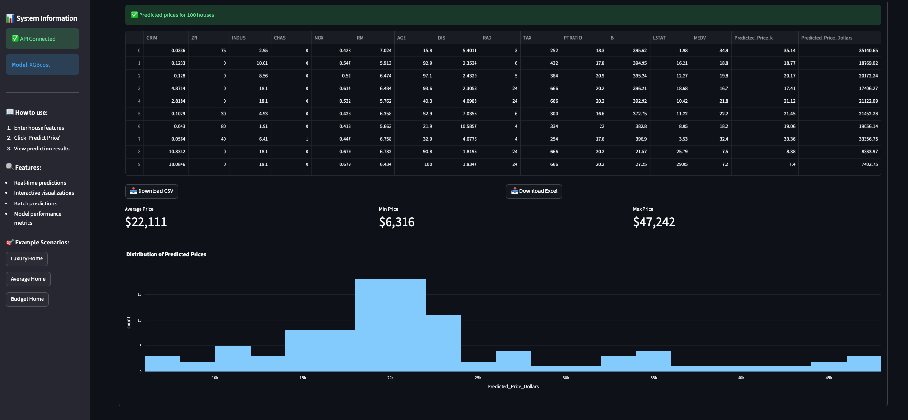
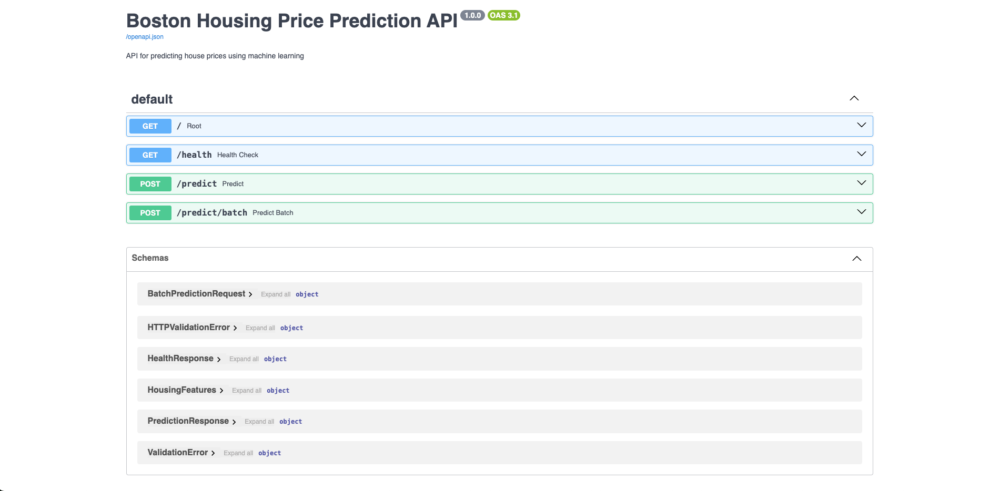
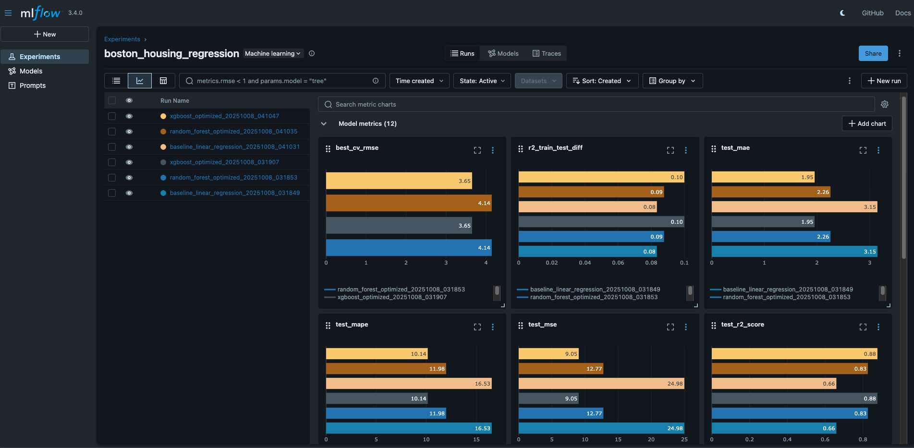

# Boston Housing Price Prediction - MLOps Project

A complete MLOps solution for predicting house prices using the Boston Housing dataset, featuring reproducible pipelines, REST API, monitoring, and model comparison.


<p align="center">
  
</p>

<p align="center">
  
</p>

<p align="center">
  
</p>

<p align="center">
  
</p>

<p align="center">
  
</p>

## Features

- **Baseline & Advanced Models**: Linear Regression baseline + optimized Random Forest and XGBoost
- **Bayesian Optimization**: Hyperparameter tuning with scikit-optimize (15 iterations)
- **Model Comparison**: Automated comparison to determine production model (≥3% R² improvement threshold)
- **MLflow Tracking**: Experiment tracking and model registry
- **REST API**: FastAPI with automatic OpenAPI documentation
- **Web Interface**: Interactive Streamlit dashboard with batch predictions
- **Drift Monitoring**: Evidently-based drift detection with HTML reports
- **Data Versioning**: DVC for dataset tracking
- **Containerization**: Docker and Docker Compose multi-service support
- **CI/CD**: GitHub Actions workflow for validation
- **Testing**: Comprehensive unit tests with pytest

---

## Quick Start

### Option 1: Docker Deployment (Recommended)

```bash
# 1. Clone repository
git clone <repository-url>
cd boston-housing-mlops

# 2. Build and start all services
docker-compose up --build

# 3. Train models inside Docker container (complete flow)
docker-compose exec api bash -c "
  python src/train_baseline.py && 
  python src/train_advanced.py --model all && 
  python src/model_comparator.py && 
  python monitoring/setup_monitoring.py
"

# Services will be available at:
# - MLflow UI: http://localhost:5000
# - API Docs: http://localhost:8000/docs
# - Streamlit UI: http://localhost:8501
```

**Note**: Always execute training scripts **inside the Docker container** using `docker-compose exec api` to avoid file system permission issues.

---

### Option 2: Local Development

```bash
# 1. Clone repository
git clone <repository-url>
cd boston-housing-mlops

# 2. Create virtual environment
python3.12 -m venv venv
source venv/bin/activate  # Linux/Mac
# venv\Scripts\activate   # Windows

# 3. Install dependencies
pip install --upgrade pip
pip install -r requirements.txt

# 4. Create necessary directories
mkdir -p data models logs monitoring_data models/figures

# 5. Configure environment variables
cp .env.example .env  # Edit .env with your settings

# 6. Train baseline model
python src/train_baseline.py

# 7. Train advanced models
python src/train_advanced.py --model all

# 8. Compare and select production model
python src/model_comparator.py

# 9. Setup monitoring
python monitoring/setup_monitoring.py

# 10. Start API (in terminal 1)
python app/api.py
# API available at: http://localhost:8000/docs

# 11. Start Streamlit UI (in terminal 2)
streamlit run app/streamlit_app.py
# UI available at: http://localhost:8501
```

---

## Project Structure

```
boston-housing-mlops/
├── src/                        # Source code
│   ├── data_loader.py          # Data loading utilities (Boston Housing CSV)
│   ├── preprocessing.py        # Preprocessing pipelines (SimpleImputer + RobustScaler)
│   ├── train_baseline.py       # Baseline Linear Regression training
│   ├── train_advanced.py       # Random Forest + XGBoost with Bayesian optimization
│   ├── model_comparator.py     # Model comparison and production promotion
│   └── utils.py                # Utility functions (metrics, plots, model saving)
├── app/                        # Application layer
│   ├── api.py                  # FastAPI REST API (predict, batch, health endpoints)
│   └── streamlit_app.py        # Streamlit web UI (interactive prediction + batch upload)
├── monitoring/                 # Monitoring system
│   ├── drift_monitor.py        # Evidently drift detection (data + performance)
│   └── setup_monitoring.py     # Initialize monitoring with reference data
├── tests/                      # Unit tests
│   ├── test_api.py             # API endpoint tests (FastAPI TestClient)
│   └── test_models.py          # Model and preprocessing tests
├── data/                       # Dataset storage
│   └── raw/HousingData.csv     # Boston Housing dataset (DVC tracked)
├── models/                     # Trained models
│   ├── baseline_linear_regression.pkl
│   ├── random_forest_optimized.pkl
│   ├── xgboost_optimized.pkl
│   ├── production.pkl          # Promoted model (symlink/copy)
│   └── figures/                # Model visualizations
├── monitoring_data/            # Monitoring artifacts
│   ├── reference_data.parquet  # Baseline data for drift detection
│   ├── drift_report_*.html     # Evidently drift reports
│   └── performance_report_*.html
├── mlruns/                     # MLflow experiment tracking
├── .github/workflows/          # CI/CD pipelines
│   └── ci.yml                  # GitHub Actions (syntax validation)
├── Dockerfile                  # Docker image definition
├── docker-compose.yml          # Multi-service orchestration
├── requirements.txt            # Python dependencies
├── .env                        # Environment variables
├── .dvc/                       # DVC configuration
├── data.dvc                    # DVC dataset tracking
└── README.md                   # This file
```

---

## API Usage

### Single Prediction

```bash
curl -X POST "http://localhost:8000/predict" \
  -H "Content-Type: application/json" \
  -d '{
    "CRIM": 0.00632,
    "ZN": 18.0,
    "INDUS": 2.31,
    "CHAS": 0,
    "NOX": 0.538,
    "RM": 6.575,
    "AGE": 65.2,
    "DIS": 4.0900,
    "RAD": 1,
    "TAX": 296.0,
    "PTRATIO": 15.3,
    "B": 396.90,
    "LSTAT": 4.98
  }'
```

**Response:**
```json
{
  "predicted_price": 24.5,
  "predicted_price_dollars": 24500.0,
  "prediction_time": "2025-01-20T10:30:00",
  "model_version": "Random Forest v1.0"
}
```

### Batch Prediction

```bash
curl -X POST "http://localhost:8000/predict/batch" \
  -H "Content-Type: application/json" \
  -d '{
    "houses": [
      {
        "CRIM": 0.00632, "ZN": 18.0, "INDUS": 2.31, "CHAS": 0,
        "NOX": 0.538, "RM": 6.575, "AGE": 65.2, "DIS": 4.09,
        "RAD": 1, "TAX": 296.0, "PTRATIO": 15.3, "B": 396.90, "LSTAT": 4.98
      },
      {
        "CRIM": 0.02731, "ZN": 0.0, "INDUS": 7.07, "CHAS": 0,
        "NOX": 0.469, "RM": 6.421, "AGE": 78.9, "DIS": 4.9671,
        "RAD": 2, "TAX": 242.0, "PTRATIO": 17.8, "B": 396.90, "LSTAT": 9.14
      }
    ]
  }'
```

**Limit**: Maximum 100 houses per batch request.

### Health Check

```bash
curl "http://localhost:8000/health"
```

**Response:**
```json
{
  "status": "healthy",
  "model_loaded": true,
  "model_version": "Random Forest v1.0",
  "model_metrics": {
    "r2_score": 0.8645,
    "rmse": 3.251,
    "mae": 2.134
  },
  "timestamp": "2025-01-20T10:30:00"
}
```

---

## Model Training Details

### Baseline Model (Linear Regression)

**Purpose**: Simple, interpretable baseline for comparison.

**Characteristics:**
- **Algorithm**: Linear Regression with RobustScaler
- **Interpretability**: High - coefficients directly interpretable
- **Training time**: ~1 second
- **Preprocessing**: SimpleImputer(median) + RobustScaler
- **Use case**: When interpretability > performance

**Command:**
```bash
# Inside Docker
docker-compose exec api python src/train_baseline.py

# Local
python src/train_baseline.py
```

**Output:**
- `models/baseline_linear_regression.pkl` (Pipeline with preprocessing + model)
- `models/baseline_linear_regression_metadata.json`
- Visualization: `models/figures/baseline_predictions_*.png`

---

### Advanced Models

#### Random Forest

**Characteristics:**
- **Optimization**: Bayesian with 15 iterations (scikit-optimize)
- **Search space**:
  - `n_estimators`: [50, 300]
  - `max_depth`: [3, 5]
  - `min_samples_split`: [2, 20]
  - `min_samples_leaf`: [1, 10]
  - `max_features`: [0.3, 1.0]
  - `bootstrap`: [True, False]
- **Cross-validation**: 5-fold KFold
- **Training time**: ~5-10 minutes
- **Feature importance**: Available (Gini-based)

#### XGBoost

**Characteristics:**
- **Optimization**: Bayesian with 15 iterations
- **Search space**:
  - `n_estimators`: [50, 300]
  - `max_depth`: [3, 10]
  - `learning_rate`: [0.01, 0.3] (log-uniform)
  - `subsample`: [0.6, 1.0]
  - `colsample_bytree`: [0.6, 1.0]
  - `min_child_weight`: [1, 10]
  - `gamma`: [0, 5]
  - `reg_alpha`: [0, 10] (L1)
  - `reg_lambda`: [0, 10] (L2)
- **Cross-validation**: 5-fold KFold
- **Training time**: ~5-10 minutes
- **Feature importance**: Available (gain-based)

**Commands:**
```bash
# Train specific model (inside Docker)
docker-compose exec api python src/train_advanced.py --model random_forest
docker-compose exec api python src/train_advanced.py --model xgboost

# Train all models
docker-compose exec api python src/train_advanced.py --model all

# Custom iterations
docker-compose exec api python src/train_advanced.py --model xgboost --n-iter 30
```

**Output:**
- `models/random_forest_optimized.pkl`
- `models/xgboost_optimized.pkl`
- Metadata files with best hyperparameters
- Visualizations: predictions + feature importance

---

## Model Comparison & Selection

The `model_comparator.py` script evaluates all trained models and recommends which to promote to production.

**Selection Criteria:**
- **Baseline preferred** if improvement < 3% R² (favors interpretability)
- **Advanced model preferred** if improvement ≥ 3% R² (justifies complexity)

**Process:**
1. Loads all trained models (baseline, RF, XGBoost)
2. Evaluates on test set
3. Compares metrics (R², RMSE, MAE, MAPE)
4. Generates comparison visualization
5. Recommends model based on R² improvement threshold
6. Promotes recommended model to `models/production.pkl`

**Command:**
```bash
# Inside Docker
docker-compose exec api python src/model_comparator.py
```

**Output:**
- `models/production.pkl` (promoted model)
- `models/production_metadata.json`
- `models/model_comparison.csv`
- `models/comparison_report.json`
- `models/figures/model_comparison_*.png`

**Example output:**
```
═══════════════════════════════════════════════════════════
FINAL RECOMMENDATION
═══════════════════════════════════════════════════════════

Recommended Model: Random Forest

Reason: Significant improvement: R² +0.0425, RMSE -0.523

Metrics:
  r2_score: 0.8645
  rmse: $3.251k
  mae: $2.134k

✓ Model promoted to production: models/production.pkl
```

---

## Monitoring & Drift Detection

### Setup Monitoring

**Creates reference data baseline for drift comparison.**

```bash
# Inside Docker
docker-compose exec api python monitoring/setup_monitoring.py
```

**What it does:**
1. Loads production model
2. Uses test set as reference data
3. Generates predictions on reference data
4. Saves to `monitoring_data/reference_data.parquet`

**Output:**
- `monitoring_data/reference_data.parquet` (baseline dataset)

---

### Run Drift Monitoring

**Compares production data against reference baseline.**

```bash
# Inside Docker
docker-compose exec api python monitoring/drift_monitor.py
```

**Monitors:**
- **Data Drift**: Distribution changes in features (Kolmogorov-Smirnov, Chi-squared tests)
- **Performance Drift**: Model accuracy degradation on production data
- **Retraining Triggers**: Automatic detection based on:
  - Drift share > 15% (configurable via `DRIFT_THRESHOLD`)
  - MAE increase > 20% vs baseline

**Output:**
- `monitoring_data/drift_report_*.html` (interactive Evidently report)
- `monitoring_data/performance_report_*.html`
- `monitoring_data/production_data_*.parquet` (logged production samples)
- `monitoring_data/latest_monitoring_summary.json`

**Example output:**
```
═══════════════════════════════════════════════════════════
DRIFT ANALYSIS
═══════════════════════════════════════════════════════════

Dataset Drift Detected: NO ✓
Drift Share: 8.50%
Threshold: 15.00%

═══════════════════════════════════════════════════════════
PERFORMANCE MONITORING
═══════════════════════════════════════════════════════════

Production Performance:
  MAE: $2.187k
  RMSE: $3.312k
  Mean Error: $0.042k

═══════════════════════════════════════════════════════════
RETRAINING RECOMMENDATION
═══════════════════════════════════════════════════════════

✓ Model performance is stable. No retraining needed.
```

---

## Testing

### Run All Tests

```bash
# Inside Docker
docker-compose exec api pytest tests/ -v

# Local
pytest tests/ -v
```

### Run with Coverage

```bash
docker-compose exec api pytest tests/ --cov=src --cov=app --cov-report=html

# View coverage report
open htmlcov/index.html
```

### Run Specific Test File

```bash
docker-compose exec api pytest tests/test_api.py -v
docker-compose exec api pytest tests/test_models.py -v
```

### Test Categories

**API Tests (`test_api.py`):**
- Root endpoint information
- Health check response
- Single prediction validation
- Batch prediction (valid, invalid, limits)
- Input validation (negative values, missing fields, wrong types)
- Error handling

**Model Tests (`test_models.py`):**
- Data loading
- Train-test split
- Feature-target separation
- Preprocessing pipeline creation
- Pipeline fit-transform
- Data quality checks
- End-to-end pipeline with model
- Metrics calculation

---

## Additional Resources

### MLflow Tracking

Access MLflow UI to:
- Compare experiments
- View hyperparameters
- Download trained models
- View training metrics charts

**URL**: http://localhost:5000

### API Documentation

Interactive API documentation:
- **Swagger UI**: http://localhost:8000/docs
- **ReDoc**: http://localhost:8000/redoc

---

## License

MIT License - see LICENSE file for details.

---